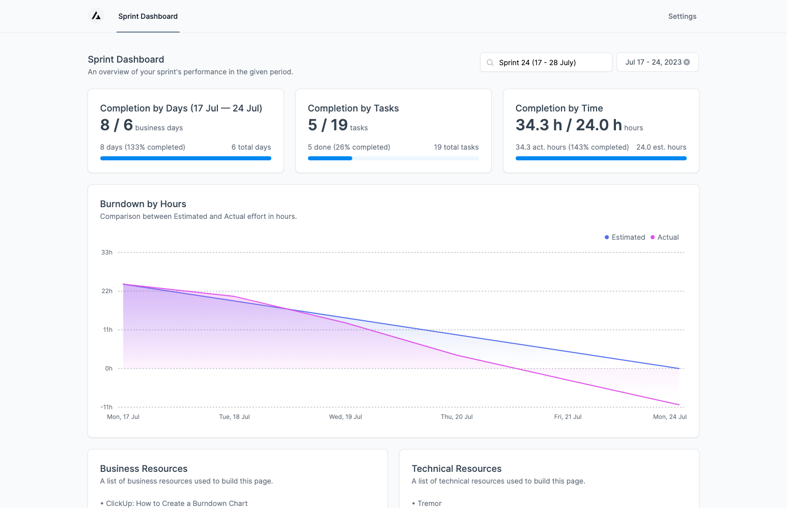

# Productive.io Analytics

Productive.io Analytics is a user-friendly open-source application that connects to your Productive.io account via your own API keys to display a sprint dashboard from your own task list. It includes task statistics and a burndown chart based on a user-specified task list and period.

## 💎 Live Demo

Visit [productive-io-analytics.vercel.app](https://productive-analytics.vercel.app) to view your sprint dashboard.



Remember to ⭐ this repo if you enjoyed it!

## 🖍️ Instructions
1. Visit the demo link above.
2. Go to the `Settings` page.
3. Retrieve your Productive API key + Org ID and place them in the settings page of the application.
4. Go to the `Sprint Dashboard` page.
5. Enter your Task List name and your given sprint period.
6. Enjoy the visualization 🎉!

## 🚀 Features

- 🔨 No installations
- 🔒 API keys stored client-side
- 📓 Persistent state in local storage
- 🚪 Login-less
- 📈 Analytical dashboard view

## 📇 About The Project

In my journey as a developer, I noticed that there wasn't a straightforward way to visualize sprints and task metrics from Productive.io without downloading bulky software or going through numerous steps.

That's why I decided to create Productive.io Analytics - a **free, open-source, login-less, and secure** way to visualize your sprints and tasks. All it takes is your Productive.io API keys, and you'll get access to your sprint dashboard complete with task statistics and a burndown chart. The best part? Your API keys are never saved - they're only stored on the client side for your security. 🔥


## 💻 Tech Stack

This project uses the following technologies:

- ⚛️ [React 18](https://reactjs.org/)
- 🌐 [Next.js 13](https://nextjs.org/) (App Router)
- 🎨 [Tailwind CSS](https://tailwindcss.com/)
- 🧱 [Tremor](https://tremor.so/)
- 📑 [Typescript](https://www.typescriptlang.org/)
- ✏️ [Prettier](https://prettier.io/)
- 🚨 [Eslint](https://eslint.org/)

## 🤝 Contributing
Pull requests are welcome. For major changes, please open an issue first to discuss what you would like to change. Any contributions you make are **greatly appreciated**.

1. Fork the Project
2. Create your Feature Branch (`git checkout -b feature/AmazingFeature`)
3. Commit your Changes (`git commit -m 'Add some AmazingFeature'`)
4. Push to the Branch (`git push origin feature/AmazingFeature`)
5. Open a Pull Request


## 🌎 Local Development

### Prerequisites

Yarn

- ```sh
  npm install --global yarn
  ```

### Development

1. Clone the repo
   ```sh
   git clone https://github.com/clodal/productive-analytics.git
   ```
2. Install NPM packages
   ```sh
   yarn install
   ```
3. Run Development instance
   ```sh
   yarn dev
   ```

## 🙏 Acknowledgements

1. Productive.io
2. Burndown Charts


## 📄 License

Distributed under the MIT License. See LICENSE for more information.


# 📧 Contact

Twitter: [@c1oda1](https://twitter.com/c1oda1)
